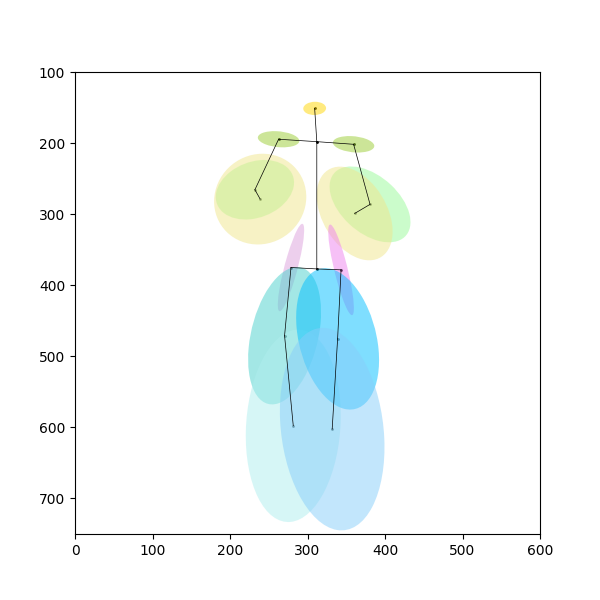

# DensePose in Detectron2

DensePose aims at learning and establishing dense correspondences between image pixels
and 3D object geometry for deformable objects, such as humans or animals.
In this repository, we provide the code to train and evaluate DensePose R-CNN and
various tools to visualize DensePose annotations and results.

There are two main paradigms that are used within DensePose project.

## [Chart-based Dense Pose Estimation for Humans and Animals](doc/DENSEPOSE_IUV.md)

<div align="center">
  
</div>

For chart-based estimation, 3D object mesh is split into charts and
for each pixel the model estimates chart index `I` and local chart coordinates `(U, V)`.
Please follow the link above to find a [detailed overview](doc/DENSEPOSE_IUV.md#Overview)
of the method, links to trained models along with their performance evaluation in the
[Model Zoo](doc/DENSEPOSE_IUV.md#ModelZoo) and
[references](doc/DENSEPOSE_IUV.md#References) to the corresponding papers.

## [Continuous Surface Embeddings for Dense Pose Estimation for Humans and Animals](doc/DENSEPOSE_CSE.md)

<div align="center">
  
</div>

To establish continuous surface embeddings, the model simultaneously learns
descriptors for mesh vertices and for image pixels.
The embeddings are put into correspondence, thus the location
of each pixel on the 3D model is derived.
Please follow the link above to find a [detailed overview](doc/DENSEPOSE_CSE.md#Overview)
of the method, links to trained models along with their performance evaluation in the
[Model Zoo](doc/DENSEPOSE_CSE.md#ModelZoo) and
[references](doc/DENSEPOSE_CSE.md#References) to the corresponding papers.

# Quick Start

See [ Getting Started ](doc/GETTING_STARTED.md)

# Installation

To install `detectron2`, reference https://detectron2.readthedocs.io/en/latest/tutorials/install.html

To activate my local environment - `conda activate py3.8`

# Model Zoo

Please check the dedicated pages
for [chart-based model zoo](doc/DENSEPOSE_IUV.md#ModelZoo)
and for [continuous surface embeddings model zoo](doc/DENSEPOSE_CSE.md#ModelZoo).

# What's New

* March 2021: [DensePose CSE (a framework to extend DensePose to various categories using 3D models)
  and DensePose Evolution (a framework to bootstrap DensePose on unlabeled data) released](doc/RELEASE_2021_03.md)
* April 2020: [DensePose Confidence Estimation and Model Zoo Improvements](doc/RELEASE_2020_04.md)

# License

Detectron2 is released under the [Apache 2.0 license](../../LICENSE)

## <a name="CitingDensePose"></a>Citing DensePose

If you use DensePose, please refer to the BibTeX entries
for [chart-based models](doc/DENSEPOSE_IUV.md#References)
and for [continuous surface embeddings](doc/DENSEPOSE_CSE.md#References).

## DensePose segment extractor
* https://raw.githubusercontent.com/tintinrevient/detectron2/main/projects/DensePose/densepose/vis/base.py
* https://raw.githubusercontent.com/tintinrevient/detectron2/main/projects/DensePose/densepose/vis/extractor.py
* https://raw.githubusercontent.com/tintinrevient/detectron2/main/projects/DensePose/densepose/vis/densepose_results.py

## DensePose normalization

<p float="left">
    
</p>

## Keypoints in elliptical standard distribution

1. For the natural poses of the COCO dataset (DensePose), execute the command below:
```bash
 python distribution_keypoints_densepose.py
```

2. For the artistic poses (OpenPose), execute the command below:
```bash
 python distribution_keypoints_openpose.py
```

<p float="left">
    
    
</p>

3. Execute the command below to do a Chi-squared or ANOVA test, to verify whether COCO man and woman, natural and artistic poses, etc., are significantly different:
```bash
python chisquare_anova.py
```

## Triplet of keypoints to calculate the inner angles

1. Execute the following command to generate the angle CSV 'joint_angles_man.csv' or 'joint_angles_woman.csv' in the 'output' folder:
```bash
python util_angle_of_keypoints.py 
```

2. Copy the angle CSV 'joint_angles_man.csv' or 'joint_angles_woman.csv' to the 'output' folder in [pose-analysis](https://github.com/tintinrevient/pose-analysis);

3. Generate the dendrogram in [pose-analysis](https://github.com/tintinrevient/pose-analysis):
```bash
python hierarchical_clustering.py
```

## OpenPose (artistic poses) - Put normalized dilated symmetrical segments back to the original pose

1. Execute the command below to generate the file 'norm_segm.csv' in the 'output' folder:
```bash
python visualize_rect_segm.py --input datasets/modern/Paul\ Delvaux/90551.jpg --gender woman
```

<p float="left">
    
    
</p>

2. Execute the command below to visualize the normalized segments on the original image:
```bash
python visualize_norm_segm.py --input datasets/modern/Paul\ Delvaux/90551.jpg
```

<p float="left">
    
</p>

3. Execute the command below to generate the average contour for this artist:
```bash
python visualize_avg_segm.py --input datasets/modern/Paul\ Delvaux/90551.jpg --contour artist
```

<p float="left">
    
    
</p>

## DensePose (COCO natural poses) - Put normalized dilated symmetrical segments back to the original pose

1. Execute the command below to generate the file 'norm_segm_coco_man.csv' and 'norm_segm_coco_woman.csv'' in the 'output' folder:
```bash
 python visualize_rect_segm_coco.py
```

2. Execute the command below to visualize the normalized segments on the original image:
```bash
python visualize_norm_segm_coco.py
```

<p float="left">
    
</p>

3. Execute the command below to generate the average contour for men and women:
```bash
python visualize_avg_segm.py --input datasets/modern/Paul\ Delvaux/90551.jpg --contour woman
python visualize_avg_segm.py --input datasets/classical/Michelangelo/12758.jpg --contour man
```

## The contour of the Vitruvian Man

1. Execute the command below with the function 'extract_contour_on_vitruve()' to generate the contour of the Vitruvian Man:
```bash
python distribution_segm.py
```

<p float="left">
    
</p>

## The variant of Impressionism

1. Comment and uncomment the code below in generate_index_name() of visualize_norm_segm.py:
```python
# each artist
# iter_list = [iter.start() for iter in re.finditer(r"/", infile)]
# artist = infile[iter_list[1] + 1:iter_list[2]]
# painting_number = infile[iter_list[2] + 1:infile.rfind('.')]

# impressionism
artist = 'Impressionism'
painting_number = int(infile[infile.rfind('/')+1:infile.rfind('.')])
```

2. Execute the command below to visualize the normalized segments on the original image:

```bash
python visualize_norm_segm.py --input datasets/impressionism/50921.jpg
```

3. Comment and uncomment the code below in visualize() of visualize_avg_segm.py:
```python
# each artist
# iter_list = [iter.start() for iter in re.finditer(r"/", infile)]
# artist = args.input[iter_list[1] + 1:iter_list[2]]
# painting_number = args.input[iter_list[2] + 1:args.input.rfind('.')]
# index_name = '{}_{}_{}'.format(artist, painting_number, openpose_idx)

# impressionism
artist = 'Impressionism'
painting_number = int(infile[infile.rfind('/')+1:infile.rfind('.')])
index_name = '{}_{}_{}'.format(artist, painting_number, openpose_idx)
```

4. Comment and uncomment the code below in generate_outfile() of visualize_avg_segm.py:
```python
# each artist
# iter_list = [iter.start() for iter in re.finditer(r"/", infile)]
# category = infile[iter_list[0] + 1:iter_list[1]]
# artist = infile[iter_list[1] + 1:iter_list[2]]
# painting_number = infile[iter_list[2] + 1:infile.rfind('.')]
#
# outfile_norm = os.path.join('output', 'pix', category, artist, '{}_on_{}_contour.jpg'.format(painting_number, contour))
# outfile_contour = os.path.join('output', 'pix', category, artist, 'average_contour_{}.jpg'.format(contour))

# impressionism
artist = 'Impressionism'
painting_number = int(infile[infile.rfind('/')+1:infile.rfind('.')])
```

5. Execute the command below to generate the average contour for Impressionism:
```bash
python visualize_avg_segm.py --input datasets/impressionism/19881.jpg --contour artist
```

## Superimpose the average contour on the pose

1. Write down the average contour data in 'contour.csv' in the 'output' folder (scaler = 0);

2. Execute the command below to superimpose the average contour on one pose:
```bash
python visualize_contour_on_pose_coco.py
```

```bash
python visualize_contour_on_pose.py --input datasets/impressionism/19881.jpg
```

# References:
* https://www.kaggle.com/changethetuneman/densepose
* https://github.com/facebookresearch/DensePose/
* https://github.com/cocodataset/cocoapi
* https://detectron2.readthedocs.io/en/latest/tutorials/index.html
* https://detectron2.readthedocs.io/en/latest/_modules/detectron2/utils/visualizer.html
* https://github.com/facebookresearch/DensePose/blob/master/notebooks/DensePose-RCNN-Visualize-Results.ipynb
* https://github.com/facebookresearch/DensePose/blob/master/notebooks/DensePose-COCO-on-SMPL.ipynb
* https://github.com/facebookresearch/DensePose/blob/master/notebooks/DensePose-RCNN-Texture-Transfer.ipynb
* https://smpl.is.tue.mpg.de/en
* https://pytorch3d.org/tutorials/render_densepose
* https://en.wikipedia.org/wiki/Artistic_canons_of_body_proportions
* https://opencv-python-tutroals.readthedocs.io/en/latest/py_tutorials/py_imgproc/py_morphological_ops/py_morphological_ops.html
* https://docs.opencv.org/3.4/db/df6/tutorial_erosion_dilatation.html
* https://matplotlib.org/stable/gallery/statistics/confidence_ellipse.html
* https://gis.stackexchange.com/questions/238117/standard-deviational-ellipse-with-open-source-python-gdal-ogr-etc
* https://pro.arcgis.com/en/pro-app/latest/tool-reference/spatial-statistics/h-how-directional-distribution-standard-deviationa.htm
* https://matplotlib.org/stable/gallery/color/named_colors.html
* https://docs.scipy.org/doc/scipy/reference/generated/scipy.stats.f_oneway.html
