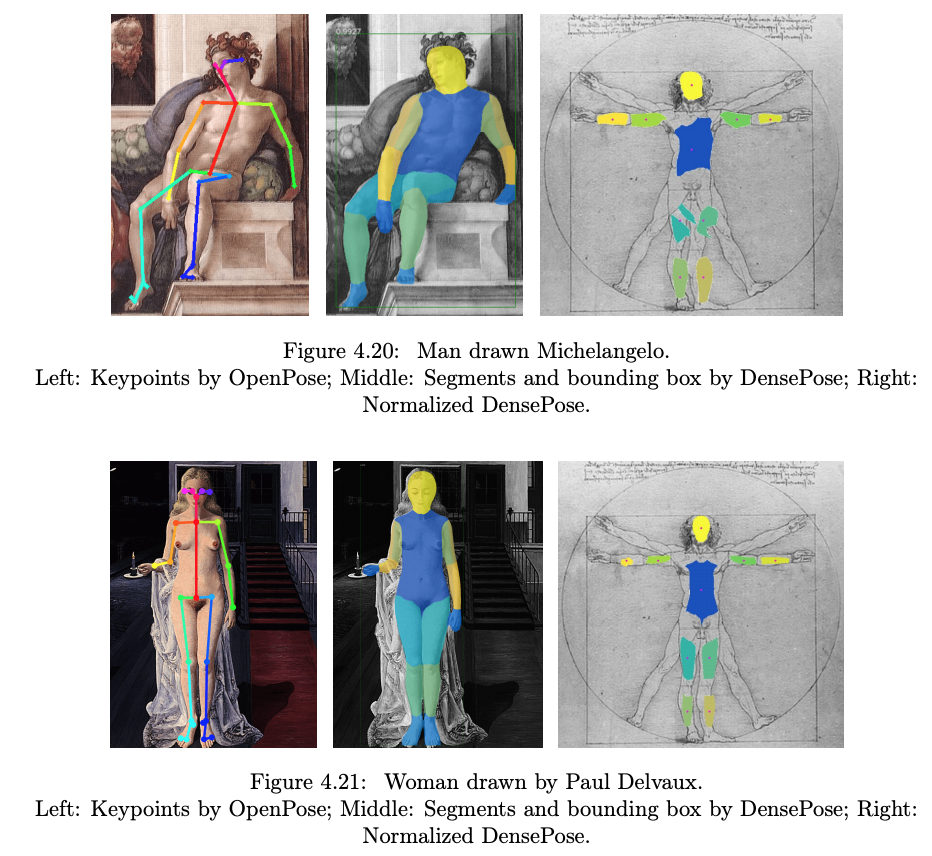

# DensePose in Detectron2

DensePose aims at learning and establishing dense correspondences between image pixels
and 3D object geometry for deformable objects, such as humans or animals.
In this repository, we provide the code to train and evaluate DensePose R-CNN and
various tools to visualize DensePose annotations and results.

There are two main paradigms that are used within DensePose project.

## [Chart-based Dense Pose Estimation for Humans and Animals](doc/DENSEPOSE_IUV.md)

  

For chart-based estimation, 3D object mesh is split into charts and
for each pixel the model estimates chart index `I` and local chart coordinates `(U, V)`.
Please follow the link above to find a [detailed overview](doc/DENSEPOSE_IUV.md#Overview)
of the method, links to trained models along with their performance evaluation in the
[Model Zoo](doc/DENSEPOSE_IUV.md#ModelZoo) and
[references](doc/DENSEPOSE_IUV.md#References) to the corresponding papers.

## [Continuous Surface Embeddings for Dense Pose Estimation for Humans and Animals](doc/DENSEPOSE_CSE.md)

  

To establish continuous surface embeddings, the model simultaneously learns
descriptors for mesh vertices and for image pixels.
The embeddings are put into correspondence, thus the location
of each pixel on the 3D model is derived.
Please follow the link above to find a [detailed overview](doc/DENSEPOSE_CSE.md#Overview)
of the method, links to trained models along with their performance evaluation in the
[Model Zoo](doc/DENSEPOSE_CSE.md#ModelZoo) and
[references](doc/DENSEPOSE_CSE.md#References) to the corresponding papers.

# Quick Start

See [ Getting Started ](doc/GETTING_STARTED.md)

# Model Zoo

Please check the dedicated pages
for [chart-based model zoo](doc/DENSEPOSE_IUV.md#ModelZoo)
and for [continuous surface embeddings model zoo](doc/DENSEPOSE_CSE.md#ModelZoo).

# What's New

* March 2021: [DensePose CSE (a framework to extend DensePose to various categories using 3D models)
  and DensePose Evolution (a framework to bootstrap DensePose on unlabeled data) released](doc/RELEASE_2021_03.md)
* April 2020: [DensePose Confidence Estimation and Model Zoo Improvements](doc/RELEASE_2020_04.md)

# License

Detectron2 is released under the [Apache 2.0 license](../../LICENSE)

## Citing DensePose

If you use DensePose, please refer to the BibTeX entries
for [chart-based models](doc/DENSEPOSE_IUV.md#References)
and for [continuous surface embeddings](doc/DENSEPOSE_CSE.md#References).

## SMPL

    

## UV texture

    
    

## DensePose segment extractor
* https://raw.githubusercontent.com/tintinrevient/detectron2/main/projects/DensePose/densepose/vis/base.py
* https://raw.githubusercontent.com/tintinrevient/detectron2/main/projects/DensePose/densepose/vis/extractor.py
* https://raw.githubusercontent.com/tintinrevient/detectron2/main/projects/DensePose/densepose/vis/densepose_results.py

## DensePose normalization

    

# References:
* https://www.kaggle.com/changethetuneman/densepose
* https://github.com/facebookresearch/DensePose/
* https://github.com/cocodataset/cocoapi
* https://detectron2.readthedocs.io/en/latest/tutorials/index.html
* https://detectron2.readthedocs.io/en/latest/_modules/detectron2/utils/visualizer.html
* https://github.com/facebookresearch/DensePose/blob/master/notebooks/DensePose-RCNN-Visualize-Results.ipynb
* https://github.com/facebookresearch/DensePose/blob/master/notebooks/DensePose-COCO-on-SMPL.ipynb
* https://github.com/facebookresearch/DensePose/blob/master/notebooks/DensePose-RCNN-Texture-Transfer.ipynb
* https://smpl.is.tue.mpg.de/en
* https://pytorch3d.org/tutorials/render_densepose
